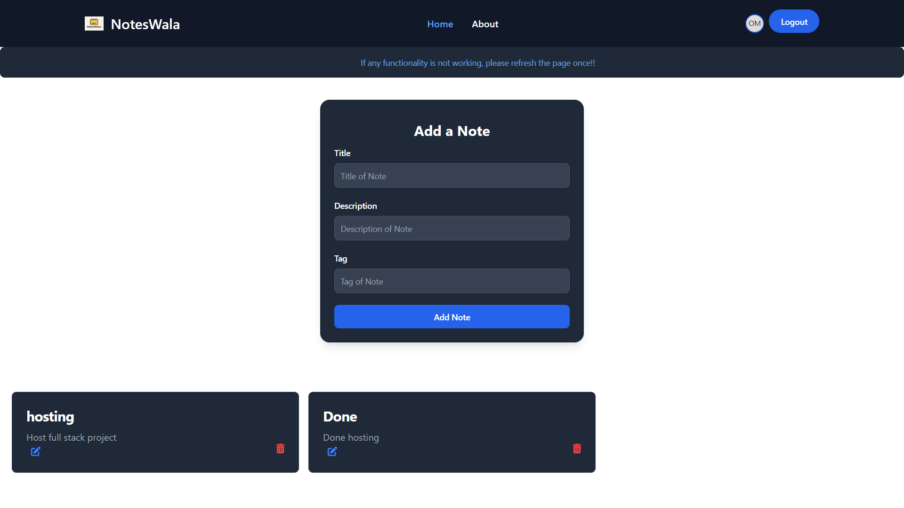
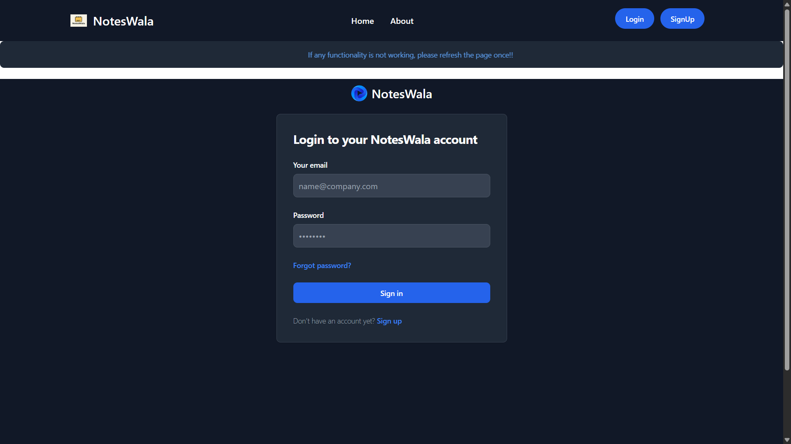

# NotesWala

NotesWala is a modern, secure, and user-friendly full-stack web application for managing your notes efficiently. Built with **React**, **Vite**, **Node.js**, **Express**, and **MongoDB**, it provides a seamless experience for users to create, edit, delete, and organize their notes from any device.

---

## 🚀 Features

- **User Authentication**
  - Secure signup and login using JWT tokens.
  - Notes are private and accessible only to the logged-in user.

- **Create Notes**
  - Add new notes with a title, description, and optional tag.

- **Edit Notes**
  - Update your existing notes anytime to keep your information up-to-date.

- **Delete Notes**
  - Remove notes you no longer need with a single click.

- **View Notes**
  - Instantly view all your notes in a clean and organized layout.

- **Search Notes**
  - Quickly find notes by searching for keywords in titles or descriptions.

- **Responsive Design**
  - Enjoy a seamless experience on both desktop and mobile devices.
  - Functional hamburger menu for easy navigation on mobile.

- **Profile Dropdown**
  - Access your profile information and logout easily from the avatar dropdown menu.

- **Notifications**
  - Get instant feedback for actions like login, logout, note creation, and deletion via toast notifications.

- **Dark Mode Support**
  - Experience a visually comfortable interface with dark mode compatibility.

- **Secure Backend**
  - All data is securely stored and managed through a robust backend API.

---

## 🛠️ Tech Stack

- **Frontend:** React, Vite, Tailwind CSS, React Router, React Toastify
- **Backend:** Node.js, Express.js, MongoDB, JWT, bcrypt
- **Deployment:** Render

---

## 📦 Project Structure

```
learning_3/
├── Backend/           # Express backend (API, DB, Auth)
│   ├── routes/
│   ├── middleware/
│   ├── models/
│   ├── db.js
│   └── index.js
├── public/            # Static assets (logo, etc.)
├── src/               # React frontend
│   ├── Components/
│   ├── context/
│   ├── App.jsx
│   └── main.jsx
├── .env
├── package.json
└── README.md
```

---

## ⚡ Getting Started

### 1. **Clone the repository**
```bash
git clone https://github.com/omkadu8767/NotesWala.git
cd NotesWala
```

### 2. **Install dependencies**
```bash
npm install
cd Backend
npm install
```

### 3. **Set up environment variables**

- **Frontend:**  
  Create a `.env` file in the root:
  ```
  VITE_HOST=http://localhost:5000
  ```

- **Backend:**  
  Create a `.env` file in the `Backend` folder:
  ```
  MONGO_URI=your_mongodb_connection_string
  JWT_SECRET=your_jwt_secret
  ```

### 4. **Run the app locally**
```bash
# In project root
npm run both
```
- Frontend: [http://localhost:5173](http://localhost:5173)
- Backend: [http://localhost:5000](http://localhost:5000)

---

## 🌐 Deployment

- The app is ready to deploy on [Render](https://render.com/).
- See the deployment section in this README or your project documentation for step-by-step instructions.

---

## 👤 Developed By

- [Om Kadu](https://www.linkedin.com/in/om-kadu-53305425a/)

---

## 💡 Screenshots

### Notes Management



### Login Interface



---

## 🙏 Acknowledgements

- [React](https://react.dev/)
- [Vite](https://vitejs.dev/)
- [Tailwind CSS](https://tailwindcss.com/)
- [MongoDB](https://www.mongodb.com/)
- [Render](https://render.com/)